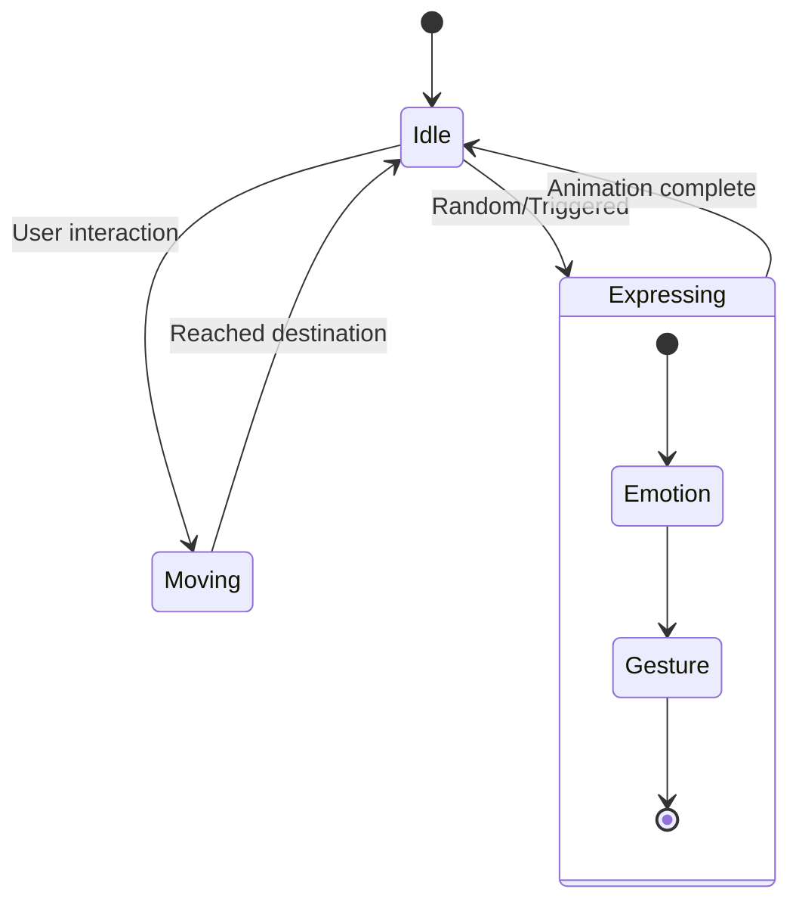

# Autonomous Character System Design

## Overview
This document outlines the design for transforming MAYA into an autonomous character that can move and interact with the environment. The system will enable MAYA to navigate the screen, express emotions through movement, and respond to user interactions in a more dynamic way.

## Core Components

### 1. Character Animation System

#### 1.1 Sprite Sheets & Animation States
- **Idle Animations**: Subtle breathing, blinking
- **Movement Animations**: Walking, turning, gestures
- **Emotional States**: Happy, thinking, listening, speaking
- **Interaction States**: Pointing, waving, typing

#### 1.2 Rigging System
- Bone-based rigging for smooth animations
- Physics-based secondary motion (hair, clothing)
- Blinking and lip-sync system

### 2. Autonomous Behavior Engine

#### 2.1 State Machine


#### 2.2 Behavior Triggers
- **User Interaction**: Mouse movement, clicks, voice commands
- **Time-based**: Idle behaviors, periodic movements
- **Content-aware**: Reacts to conversation topics
- **Environment**: Window resizing, time of day

### 3. Movement System

#### 3.1 Pathfinding
- A* algorithm for screen navigation
- Collision detection with screen boundaries
- Smooth interpolation between points

#### 3.2 Movement Types
- **Direct Movement**: Controlled path to destination
- **Wandering**: Random movement within bounds
- **Following**: Track mouse or focus element

### 4. Emotion & Personality System

#### 4.1 Emotional States
- Joy, curiosity, confusion, thinking
- Each state affects movement and expressions
- Smooth transitions between states

#### 4.2 Personality Matrix
```python
class Personality:
    def __init__(self):
        self.energy = 0.7      # 0.0 (calm) to 1.0 (energetic)
        self.friendliness = 0.8 # 0.0 (reserved) to 1.0 (outgoing)
        self.curiosity = 0.6   # 0.0 (indifferent) to 1.0 (inquisitive)
        self.playfulness = 0.5  # 0.0 (serious) to 1.0 (playful)
```

## Technical Implementation

### 1. Dependencies
- **PyGame/PyQt6**: For rendering and input handling
- **Pymunk**: For physics-based animations
- **OpenCV**: For face/gesture recognition (optional)
- **Spine2D/DragonBones**: For skeletal animation (optional)

### 2. Animation Pipeline
1. **Asset Creation**
   - Design character in 2D/3D software
   - Export as sprite sheets or skeletal animation
   - Define animation states and transitions

2. **Integration**
   - Load animations into the game engine
   - Set up state machine parameters
   - Define transition conditions

### 3. AI Integration

#### 3.1 Decision Making
```python
class AIController:
    def update(self, delta_time):
        self.current_state.update(delta_time)
        self.emotion_system.update()
        self.move_towards_target()
        self.update_animations()

    def react_to_user_input(self, input_event):
        # Process input and trigger appropriate reactions
        pass
```

#### 3.2 Behavior Tree
- Root: Selector node
  - Sequence: Check for user interaction
  - Selector: Idle behaviors
    - Wander around
    - Play random animations
    - Look at points of interest

## Development Phases

### Phase 1: Basic Movement (2-3 weeks)
- Implement sprite rendering
- Basic state machine
- Simple pathfinding
- Window boundary detection

### Phase 2: Animation System (3-4 weeks)
- Animation state machine
- Basic emotions and expressions
- Smooth transitions

### Phase 3: Advanced Behaviors (4-6 weeks)
- Personality system
- Complex interactions
- Environment awareness
- Advanced animations

### Phase 4: Polish & Optimization (2-3 weeks)
- Performance optimization
- Memory management
- Bug fixes
- User customization options

## Technical Considerations

### Performance
- Use object pooling for animations
- Implement level-of-detail (LOD)
- Optimize collision detection

### Cross-Platform Support
- Handle different screen resolutions
- Account for platform-specific input methods
- Optimize for both desktop and mobile

### Extensibility
- Modular design for easy addition of new animations
- Scriptable behaviors
- Plugin system for custom actions

## Example Use Cases

1. **Idle Behavior**
   - Character moves to a random position
   - Plays idle animation
   - Occasionally looks around or changes expression

2. **User Interaction**
   - Character turns to face the mouse
   - Waves when clicked
   - Reacts to voice commands with appropriate animations

3. **Content-Aware**
   - Leans in when important information is displayed
   - Points to UI elements when explaining features
   - Shows thinking animation during processing

## Future Enhancements

1. **Advanced AI**
   - Machine learning for adaptive behaviors
   - Emotion recognition from user input
   - Predictive movement

2. **VR/AR Integration**
   - 3D character model
   - Room-scale interactions
   - Hand tracking

3. **Multi-Character System**
   - Multiple characters interacting
   - Group behaviors
   - Character-to-character communication

## Testing Strategy

1. **Unit Tests**
   - State transitions
   - Movement calculations
   - Collision detection

2. **Integration Tests**
   - Full behavior sequences
   - Interaction with other systems
   - Performance under load

3. **User Testing**
   - Natural feel of movements
   - Responsiveness
   - Performance on different hardware
